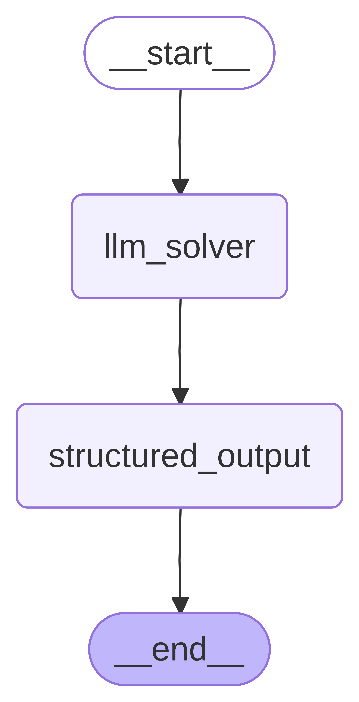
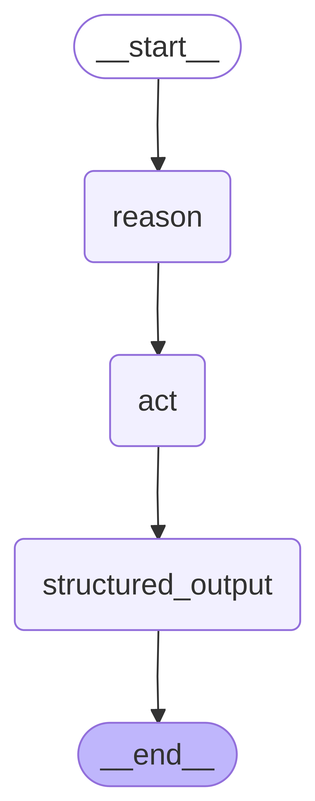
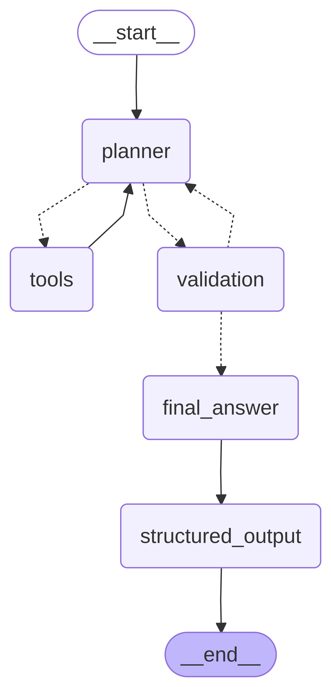
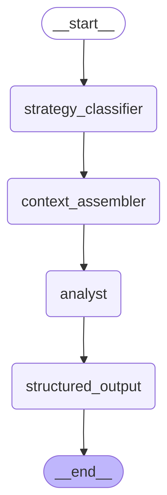

# agentic-sysadmin
Official repository of **Toward Agentic SysAdmin: Rethinking System Administration with AI Agents** 


## Installation

### Prerequisites

- Python 3.13+ (Recommended)
- Git installed on your system
- Docker (required by Kathara for network emulation)

### Setup Instructions

```bash
git clone https://github.com/pajola/agentic-sysadmin.git
cd agentic-sysadmin

# Install python dependencies
pip install -r requirements.txt
```

If you wish to use AWS Bedrock models, or telegram notification for experiment updates, you need to setup a .env file with the following credentials.

```bash
AWS_ACCESS_KEY_ID=""<your_api_key>""
AWS_ACCESS_ACCESS_KEY=""

TELEGRAM_BOT_TOKEN=""
TELEGRAM_CHAT_ID=""
```

## Architecture

The framework is built around three main components: **Solvers**, **Questions**, and the **Analysis Engine**.

### Solvers

Solvers are the LLM-based systems that attempt to answer network questions. Each solver implements a different strategy, built as a [LangGraph](https://langchain-ai.github.io/langgraph/) workflow.

#### Bulk Processing Solver

A simple two-step pipeline: all lab configuration files are injected into the prompt, and the LLM answers in a single pass.

```
START -> llm_solver -> structured_output -> END
```
<p align="center">

</p>
- **Call 1 (`llm_solver`)**: Full lab context + question as a single prompt
- **Call 2 (`structured_output`)**: Conversation history + structured output system prompt -> Pydantic model

#### Bulk ReAct Solver

A three-step Reason-Act pipeline: the LLM first reasons about the question, then formulates an answer, and finally structures the output.

```
START -> reason -> act -> structured_output -> END
```
<p align="center">

</p>
- **Call 1 (`reason`)**: System prompt with full lab context + question -> step-by-step reasoning
- **Call 2 (`act`)**: Previous messages + action prompt -> direct answer
- **Call 3 (`structured_output`)**: Full conversation history + structured output prompt -> Pydantic model

Both bulk solvers accumulate messages across calls. The **worst-case context usage** is always the last call, which sees all previous messages.

#### Planner Agent Solver

An agentic solver with a planner-validator loop. The planner uses tools to selectively read lab files (and optionally query the live network), then a validator checks completeness before producing the final answer.

```
START -> planner <-> tools (self-loop while gathering data)
              |
              v (no more tool calls)
          validation
              | COMPLETE -> final_answer -> structured_output -> END
              | INCOMPLETE -> planner (loop back, max 3 retries)
```
<p align="center">

</p>
**Nodes:**
- **`planner`**: Reasons about the question, decides which tools to call. Loops with the tool node until it has gathered enough data.
- **`tools`**: Executes tool calls (list files, read configs, etc.) and returns results to the planner.
- **`validation`**: Checks if the collected data is sufficient to fill every field of the output schema. Routes to `final_answer` (COMPLETE) or back to `planner` (INCOMPLETE, up to 3 retries).
- **`final_answer`**: Synthesizes all retrieved data into a natural-language answer.
- **`structured_output`**: Converts the final answer into the expected Pydantic model.

**Safety limits:**
- `max_iterations` (default 25): caps the total number of planner invocations (tool-calling rounds), preventing runaway tool-call loops.
- `max_validation_retries` (default 3): caps validator→planner retry cycles, so the validator cannot loop indefinitely on INCOMPLETE.

**Available tools (file-only):** `list_lab_files`, `read_lab_conf`, `read_file`, `get_devices_name`, `get_device_config`

#### Guided Retrieval Agent Solver

A lightweight agentic solver that decouples retrieval strategy from reasoning. The LLM picks one of five retrieval strategies; the system then assembles context deterministically (and runs live probes when needed) and only afterwards passes the curated context to the analyst.

```
START -> strategy_classifier -> context_assembler -> [prober] -> analyst -> structured_output -> END
```
<p align="center">

</p>
- **`strategy_classifier`** (LLM): picks one of `topology_only`, `ip_analysis`, `device_pair`, `live_connectivity`, `service_scan`.
- **`context_assembler`** (deterministic): reads the lab files relevant to the chosen strategy.
- **`prober`** (deterministic, conditional): executes live network commands (traceroute, ps aux, etc.) only for `live_connectivity` / `service_scan`.
- **`analyst`** (LLM, no tools): reasons over the curated context.
- **`structured_output`** (LLM): emits the Pydantic answer; falls back to the assembled context if the analyst returned empty content.

Total: 3 LLM calls (vs 4-10 for PlannerAgent, 2-3 for bulk). Designed for small local models that struggle with tool-binding loops.

### Questions

Questions are modular plugins that define:
- A **question text** posed to the LLM
- A **Pydantic output model** specifying the expected structured response
- A **ground truth function** that computes the correct answer from the live Kathara network

Available questions:

| Question | Description |
|----------|-------------|
| `CountNodesQuestion` | Count the number of network devices |
| `SubnetworksQuestion` | Identify all subnetworks |
| `DevicesWithMostIPsQuestion` | Find devices with the most IP addresses |
| `DevicesWithMultipleIPsQuestion` | Find devices with multiple IPs |
| `IPv6AddressesQuestion` | List all IPv6 addresses |
| `CommonSubnetworkQuestion` | Find common subnetworks between two devices |
| `CanPingWithoutHopQuestion` | Check if two devices can ping without intermediate hops |
| `EnabledServicesQuestion` | List enabled network services |
| `ZoneTransferQuestion` | Check DNS zone transfer configuration |
| `TracerouteQuestion` | Determine the traceroute path between devices |

Questions can be restricted to specific labs using `lab_whitelist`:
```python
CanPingWithoutHopQuestion(m1="server1", m2="r1", lab_whitelist=["lab_medium-nat-web"])
```

### Analysis Engine

The `AnalysisEngine` orchestrates experiment execution:

1. **Preflight check**: pings `{base_url}/api/tags` for every `ChatOllama` model and drops `(model, solver)` pairs whose model isn't pulled. Skipped pairs are reported in `summary.json` under `skipped_models` and included in the Telegram notification.
2. **Ground-truth cache**: per-lab JSON cache keyed on a SHA-256 hash of all lab files. Subsequent runs skip Kathara probes when the lab is unchanged.
3. Iterates over labs, applicable questions, model/solver pairs, and repetitions.
4. For each run: instantiates the solver, executes it, compares against ground truth via `DeepDiff`, captures token usage and an error type if anything went wrong.
5. **Historical merge** (optional): records from previous experiments can be merged in via `historical_results=[...]`, with compatibility filtering on labs/questions/repetitions and override on live pairs.
6. Saves per-run execution logs, a consolidated `errors.jsonl`, and a `partial_results.json` after every lab so partial progress is never lost.

#### Token tracking

Every solver attaches a `TokenUsageCallback` (LangChain callback handler) to its `app.invoke(...)`. The callback reads `usage_metadata` from every chat model response (input/output/total tokens) and stores the snapshot in `solver.last_token_stats`. The engine then writes `tokens_input`, `tokens_output`, `tokens_total`, `n_llm_calls` into each result record, and aggregates `mean_tokens_total`, `sum_tokens_total`, etc. per `(model, solver)` pair in the summary.

#### Error categorization

When a solver fails or produces an unusable answer, the engine classifies it into one of:

| `error_type`         | Cause |
|----------------------|-------|
| `empty_response`     | LLM returned blank content (detected in `structured_output` nodes) |
| `json_parse_error`   | Pydantic `ValidationError` or `json.JSONDecodeError` (structured-output rejection) |
| `tool_loop_exceeded` | LangGraph hit its `recursion_limit` |
| `kathara_error`      | Network probe or Kathara client failure |
| `other`              | Everything else |

Each failure is also appended (one JSON line per error) to `<log_dir>/errors.jsonl` with full traceback and the raw LLM response, so failures can be inspected without combing through per-run logs.

## Usage

### Step 1: Set Up Network Labs

Create a `labs/` folder and add Kathara lab configurations. You can find example labs in the [Kathara Labs repository](https://github.com/KatharaFramework/Kathara-Labs).

```
net-topology-checker/
|-- labs/
|   |-- lab_bgp_announcement/
|   |   |-- lab.conf
|   |   |-- router1.startup
|   |   |-- router2.startup
|   |-- lab_medium-nat-web/
|   |   |-- lab.conf
|   |   |-- server1.startup
|   |   |-- r1.startup
```

### Step 2: Configure and Run

Edit `main.py` to configure your experiment:

```python
from core.analysis_engine import AnalysisEngine
from solvers.bulk_processing_solver_from_files import BulkProcessingSolverFromFiles
from solvers.bulk_reAct_solver_from_files import BulkReactSolverFromFiles
from solvers.planner_agent_solver import PlannerAgentSolver, PlannerAgentSolverWithNetwork
from solvers.strategic_agent_solver import StrategicAgentSolver
from questions import CountNodesQuestion, SubnetworksQuestion

LAB_PATHS = [
    "labs/lab_medium-nat-web",
    "labs/lab_small-internet-with-dns-and-web-server",
]
REPETITIONS = 5

# Optional: paths to partial_results.json files from previous experiments.
# Records compatible with the current (lab, question, repetitions) config
# are merged in; (model, solver) pairs being re-run live override their
# historical counterparts. Useful to iterate on a single solver without
# re-running every baseline.
HISTORICAL_RESULTS = [
    # "local_models/partial_results.json",
    # "experiment_logs/20260521_074715/partial_results.cleaned.json",
]

questions = [
    CountNodesQuestion(),
    SubnetworksQuestion(),
]

results = AnalysisEngine.run_analysis(
    lab_paths=LAB_PATHS,
    questions=questions,
    llm_solver_pairs=[
        (my_model, BulkProcessingSolverFromFiles),
        (my_model, BulkReactSolverFromFiles),
        (my_model, PlannerAgentSolver),
        (my_model, GuidedRetrievalAgentSolver),
    ],
    repetitions=REPETITIONS,
    historical_results=HISTORICAL_RESULTS or None,
)
```

Then run:
```bash
python main.py
```

### Step 3: Inspect Results

The analysis produces two types of output:

#### Analysis Results JSON (`analysis_results.json`)

Contains flat results and **grouped results**. The grouped results show per-run accuracy for each (lab, question, model, solver) combination:

```json
{
  "grouped_results": [
    {
      "lab_name": "lab_medium-nat-web",
      "question": "How many nodes are in the network?",
      "model": "qwen3.5:9b (ollama)",
      "solver": "PlannerAgentSolver",
      "total_runs": 5,
      "correct_runs": 3,
      "accuracy": "3/5",
      "accuracy_pct": 60.0,
      "runs": [
        {"run_index": 1, "correct": true, "solver_elapsed_time": 12.3, "tokens_total": 4821, "n_llm_calls": 5, "error_type": null},
        {"run_index": 2, "correct": false, "solver_elapsed_time": 15.1, "tokens_total": 6210, "n_llm_calls": 7, "error_type": "json_parse_error"},
        {"run_index": 3, "correct": true, "solver_elapsed_time": 11.8, "tokens_total": 4503, "n_llm_calls": 5, "error_type": null}
      ]
    }
  ],
  "pair_summary": [
    {
      "model": "qwen3.5:9b (ollama)",
      "solver": "PlannerAgentSolver",
      "n": 30, "n_all": 32, "correct": 24, "accuracy_pct": 80.0,
      "mean_tokens_total": 5021, "sum_tokens_total": 150630,
      "errors": {"json_parse_error": 1, "empty_response": 1}
    }
  ]
}
```

This allows you to identify exactly which runs failed (and why), how many tokens each pair burned, and inspect their detailed logs.

#### Execution Logs (`experiment_logs/`)

Per-run execution logs are saved to a structured directory:

```
experiment_logs/
|-- 20260314_150000/
|   |-- partial_results.json          # incremental flat results, written after each lab
|   |-- summary.json                  # pair_summary + skipped_models + historical_sources
|   |-- errors.jsonl                  # one line per error (traceback + raw response)
|   |-- lab_medium-nat-web/
|   |   |-- How_many_nodes_are_in_the_network_/
|   |   |   |-- qwen3.5_9b__PlannerAgentSolver/
|   |   |   |   |-- run_1.json
|   |   |   |   |-- run_2.json
```

Each `run_N.json` contains a chronological list of every step in the LangGraph execution:

- **Bulk solvers**: LLM inputs (truncated to first 500 chars + total length) and full LLM outputs
- **Planner solver**: Full content for all steps including:
  - `planner` -> `llm_input` / `llm_output` (with tool_calls details)
  - `tools` -> `tool_call` (name + args) / `tool_result` (content, truncated at 2000 chars)
  - `validation` -> `llm_input` / `llm_output`
  - `final_answer` -> `llm_input` / `llm_output`
  - `structured_output` -> `llm_input` / `llm_output`

## Benchmark Dashboard

Open `benchmark_analysis_dashboard.html` directly in a browser (no server required) and load any `partial_results.json` or `summary.json` produced by an experiment.

The dashboard shows:
- **Metric cards**: total runs, correct, overall accuracy, total tokens, total errors, best/worst pair.
- **Accuracy bar chart**: one bar per `(model, solver)` pair, grouped by model.
- **Mean tokens / run**: same grouping — directly comparable across solvers for the same model.
- **Tokens vs accuracy scatter**: every pair as a bubble (bubble size = number of runs).
- **Run coverage**: stacked correct/incorrect per pair.
- **Error breakdown**: stacked bar of `error_type` counts per pair.
- **Heatmap (with `partial_results.json`)**: accuracy per `(model, solver)` × lab; clicking a lab drills into a per-question heatmap.
- **Full results table**: sortable, with avg tokens/run, total tokens, and a compact error summary column.

## Exporting Workflow Graphs

Generate PNG images of the LangGraph workflows:

```bash
python export_graphs.py
```

This produces images in the `assets/` directory for all solver architectures.

